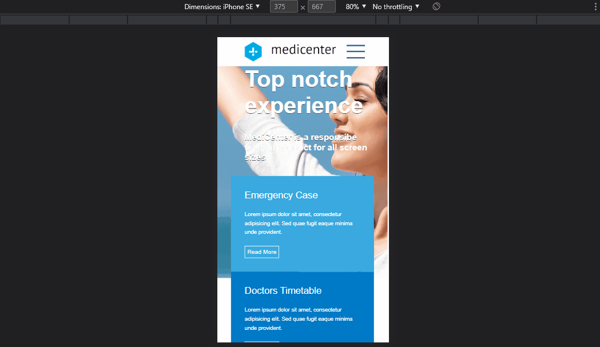

 

 
 
# Medicenter 

 

## Sobre o Projeto

***

Projeto desenvolvido no Curso B7Web com o intuito de treinar   a tecnologia Flexbox do CSS3.
 

 

***
 

## Tecnologias Utilizadas

- [x] HTML
- [x] CSS
- [x] JAVASCRIPT

 

***

## Demostração do Projeto em 

 

## Como rodar esse Projeto?

Na pasta desejada copie o código abaixo :

~~~
git@github.com:mari-moreira/MediCenter.git

~~~

 

***
Feito com muito ❤️ por <strong>Mariana </strong>
***

